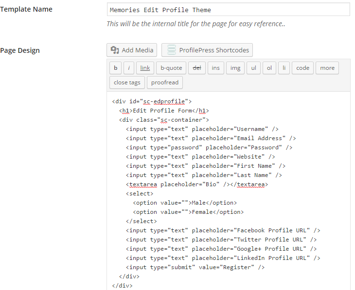

[ProfilePress](http://profilepress.net/pricing/) is the best plugin for creating frontend edit profile form for WordPress.

Using the form design below, let's build a custom frontend edit profile page for WordPress where users can edit their profile information at the front-end of your website without having to do so in WordPress dashboard or backend.


<p data-height="268" data-theme-id="14095" data-slug-hash="WvNpzy" data-default-tab="result" data-user="collizo4sky" class='codepen'>See the Pen <a href='http://codepen.io/collizo4sky/pen/WvNpzy/'>Memories Edit Profile Form</a> by Agbonghama Collins (<a href='http://codepen.io/collizo4sky'>@collizo4sky</a>) on <a href='http://codepen.io'>CodePen</a>.</p>
<script async src="//assets.codepen.io/assets/embed/ei.js"></script><br/>


Click the **Front-end Edit Profile** menu.


Click the `Add New` button at the top left corner of the page.


Enter a name for the edit-profile form in **Template Name** field.


The HTML and CSS code for the form will go into the **Page Design** and **CSS Stylesheet** textareas respectively.





**Note:** Error messages generated by edit profile forms powered by ProfilePress are wrapped in a `div` with class `<div class="profilepress-edit-profile-status">` thus the CSS class in the stylesheet.


Click the **Preview Design** button to see how the form will look.


In order for **ProfilePress** to make this a form functional, the form components will have to be replaced by their ProfilePress [shortcode equivalents](http://profilepress.net/docs/shortcode-api/edit-profile-form/)


Below is the final revision of the form code.


```
<div id="sc-edprofile">
  <h1>Edit Profile Form</h1>
  <div class="sc-container">
    [edit-profile-username title="Username" placeholder="Username"]
    [edit-profile-email title="Email Address" placeholder="Email Address"]
    [edit-profile-password title="Password" placeholder="Password"]
    [edit-profile-website title="Website" placeholder="Website"]
    [edit-profile-first-name title="First Name" placeholder="First Name"]
    [edit-profile-last-name title="Last Name" placeholder="Last Name"]
    [edit-profile-bio title="Bio" placeholder="Bio"]
    [edit-profile-cpf key="gender" type="select" title="Gender" placeholder="Gender"]
    [edit-profile-cpf key="facebook" type="text" title="Facebook Profile URL" placeholder="Facebook Profile URL"]
    [edit-profile-cpf key="twitter" type="text" title="Twitter Profile URL" placeholder="Twitter Profile URL"]
    [edit-profile-cpf key="google" type="text" title="Google+ Profile URL" placeholder="Google+ Profile URL"]
    [edit-profile-cpf key="linkedin" type="text" title="LinkedIn Profile URL" placeholder="LinkedIn Profile URL"]
    [edit-profile-submit value="Save Changes"]
  </div>
</div>
```

The shortcode for the form fields are pretty easy to understand except for Gender, Facebook Profile URL, Twitter Profile URL, Google+ Profile URL and LinkedIn Profile URL which are custom created [profile fields](../configuration/custom-fields.md).


**Note:** The [[edit-profile-cpf]](../configuration/custom-fields.md) shortcode is used for adding custom profile fields to edit profile forms.


Replace the HTML form code we earlier entered into the **Page Design** textarea with the revised code above.


Enter the notification text that will be displayed after a user successfully edited their profile into the **Profile Edited Message** field.


To make the password reset form available as a WordPress widget, tick the **Make this a Widget** check box.


Save and then click the `Back to Catalog` button.


Copy its shortcode, paste it to a WordPress page and publish.


Preview the page and you will see the registration form in action.


A [live demo](http://profilepress.net/demos/memories-edit-profile/) is available [here](http://profilepress.net/demos/memories-edit-profile/).


**Note:** To gain access to the form, you'll have to log in to the site. Use `demo` as the username and password.

We also have building a custom edit profile form for WordPress [covered here](https://profilepress.net/frontend-edit-profile-form-wordpress/)
