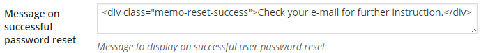

Let's see how [ProfilePress](http://profilepress.net/pricing/) can turn the password-reset form below into a working WordPress form for resetting users passwords.


<p data-height="268" data-theme-id="14095" data-slug-hash="rVNWEm" data-default-tab="result" data-user="collizo4sky" class='codepen'>See the Pen <a href='http://codepen.io/collizo4sky/pen/rVNWEm/'>Memories Password Reset Form</a> by Agbonghama Collins (<a href='http://codepen.io/collizo4sky'>@collizo4sky</a>) on <a href='http://codepen.io'>CodePen</a>.</p>
<script async src="//assets.codepen.io/assets/embed/ei.js"></script><br/>


Click the **Password Reset** menu.


Click the `Add New` button.


Enter a name for the password-reset form in **Template Name** field.  


The HTML and CSS code for the password-reset form will go into the **Password Reset Design** and **CSS Stylesheet** textareas respectively.


**Note:** Error messages generated by password reset forms powered by ProfilePress are wrapped in a `div` with class `<div class="profilepress-reg-status">` thus the `.profilepress-reg-status` CSS class in the stylesheet.


Click the **Preview Design** button to see how the form will look.


In order for **ProfilePress** to make this a functional password reset form, the form components which in this case are the username / email text field and the submit button will have to be replaced by their ProfilePress [shortcode equivalents](http://profilepress.net/docs/shortcode-api/password-reset-form/)


Below is the final revision of the Login form code.


```
<div id="sc-password">
  <h1>Reset Password</h1>
  <div class="sc-container">
    [user-login title="Username or Email" placeholder="Username or Email"]
    [reset-submit value="Get New Password"]
  </div>
</div>
```


Replace the HTML form code earlier entered into the **Password Reset Design** textarea with the revised code above.


Enter the notification text that will be displayed (after the reset request has been received for processing by WordPress internals) into the **Message on successful registration** field.





To make the password reset form available as a WordPress widget, tick the **Make this a Widget** check box.


Save and then click the `Back to Catalog` button.


Copy its shortcode, paste it to a WordPress page and publish.


Preview the page and you will see the registration form in action.


A [live demo](http://profilepress.net/demos/memories-password-reset/) of this password reset form is available [here](http://profilepress.net/demos/memories-password-reset/).
