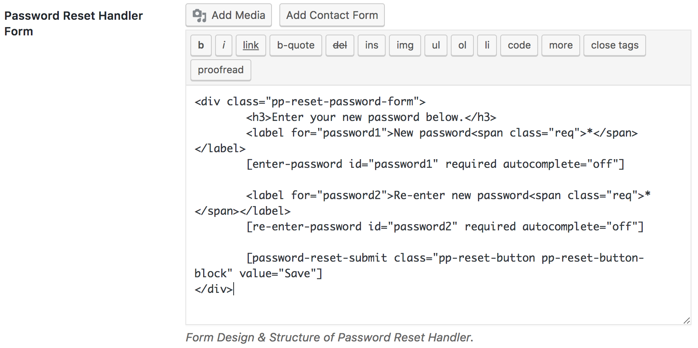
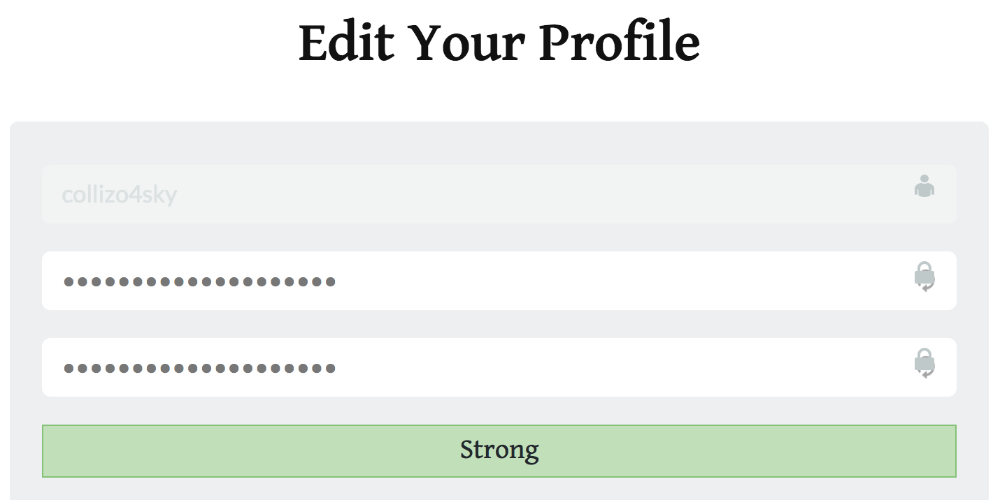

The easiest for a user account to be hacked or gain unathorized access to is when they use a weak password.

Weak passwords refer to any password that can be easily guessed, either because it's so personal to a person or because it hardly takes any time to find it via the brute-force method. For example, the following are consider weak passwords. 12345, abcde, using your first or last name.

If you run a WordPress membership site that allows user registration, you should ensure that users d not sign up with weak passwords.

One way to stop users from using weak passwords is to display a **password strength meter** on the registration form informing the user the minimum password length and the strangth of their password.

If your user registration form is powered by ProfilePress, you are in luck. Our password stregth meter do not only work with our [registration forms](https://profilepress.net/features/wordpress-front-end-registration-form/) but also [lost password forms](https://profilepress.net/features/wordpress-front-end-password-reset/) and [edit profile forms](https://profilepress.net/features/wordpress-front-end-edit-profile-form/).

ProfilePress uses the same WordPress password strength meter you are familiar with.

## Adding to WordPress Registration Form

To include the password strength mete to your registration form; open the edit your active [registration form](registration-form.md) and add the shortcode `[reg-password-meter]` where you want the password meter to display.

## Password Reset Form

Similar to the registration form above, to include password stregnth meter to password reset or lost [password form handler form](password-reset.md) (handles the actual changing of password), add the shortcode `[reset-password-meter]` where you want it shown in **Password Reset Handler Form** section.

## Edit Profile Form

To include password stregnth meter to ProfilePress powered WordPress front-end [edit profile form](edit-profile.md), add the shortcode `[edit-profile-password-meter]` where you want it shown.

