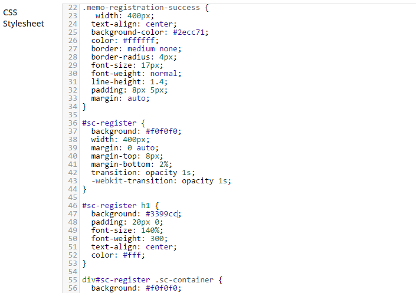

[ProfilePress](https://profilepress.net/pricing/) is the best user registration form plugin for WordPress. Let's see how it can turn the registration form below into a WordPress custom registration form.


<p data-height="268" data-theme-id="14095" data-slug-hash="zGYxZQ" data-default-tab="result" data-user="collizo4sky" class='codepen'>See the Pen <a href='http://codepen.io/collizo4sky/pen/zGYxZQ/'>Registration Form</a> by Agbonghama Collins (<a href='http://codepen.io/collizo4sky'>@collizo4sky</a>) on <a href='http://codepen.io'>CodePen</a>.</p>
<script async src="//assets.codepen.io/assets/embed/ei.js"></script><br/>


Click the **Registration Form** menu.


Click the `Add New` button.


Enter a name for the registration form in **Template Name** field.  


The HTML and CSS code for the login form will go into the **Registration Design** and **CSS Stylesheet** textareas respectively.





**Note:** Error messages generated by registration forms powered by ProfilePress are wrapped in a `div` class `<div class="profilepress-reg-status">` thus the `.profilepress-reg-status` class in the CSS stylesheet.


Click the **Preview Design** button to see how the registration form will look.


In order for **ProfilePress** to make this a functional WordPress registration form, the form components which in this case are the username, email, password, first & last name, Twitter profile text field; gender select drop-down and the submit button will have to be replaced by their ProfilePress [shortcode equivalents](http://profilepress.net/docs/shortcode-api/registration-form/)


Below is the final revision of the Login form code.


```
<div id="sc-register">
  <h1>Sign Up</h1>
  <div class="sc-container">
    [reg-username title="Username" placeholder="Username"]
    [reg-email title="Email Address" placeholder="Email Address"]
    [reg-password title="Password" placeholder="Password"]
    [reg-first-name title="First Name" placeholder="First Name"]
    [reg-last-name title="Last Name" placeholder="Last Name"]
    [reg-cpf key="gender" type="select" title="Gender"]
    [reg-cpf key="Twitter Profile URL" type="text" placeholder="Twitter Profile URL"]
    [reg-submit value="Register"]
  </div>
</div>
```


The shortcode for the form fields are pretty easy to understand except for that of the `Twitter Profile URL` and `Gender` (which are [custom profile fields](../configuration/custom-fields.md)).


The `[reg-cpf]` shortcode is used for adding custom fields to ProfilePress powered registration form.

<div class="hljs">
<p>Custom fields are fields added to WordPress to extend its profile fields.</p>
<p>By default, WordPress doesn't include the `Gender` and `Twitter profile` fields.
<a href="http://docs.profilepress.net/en/latest/configuration/custom-fields/">These fields and few other</a> are automatically added to WordPress when ProfilePress plugin is installed and activated.</p>
</div><br/>


Replace the HTML form code earlier entered into the **Registration Design** textarea with the revised code above.


Enter the notification text that will be displayed after a successful user registration into the **Message on successful registration** field.


To make the registration form available as a WordPress widget, tick the **Make this a Widget** check box.


Save and then click the `Back to Catalog` button.


Copy the created registration form shortcode, paste it to a WordPress page and publish.


Preview the page and you will see the registration form in action.


A [live demo](http://profilepress.net/demos/memories-registration-form/) of this registration form is available [here](https://profilepress.net/demos/memories-registration-form/).

We also have building a custom user registration form for WordPress [covered here](https://profilepress.net/custom-user-registration-form-wordpress/)