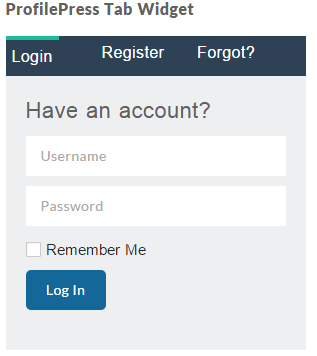

**[ProfilePress](http://profilepress.net/)** ships with a tabbed login, registration and password reset widget that is customizable.

And here is how it will look at the front-end of your website.

Couldn't be more easier than this.

## Custom Widgets

If you've gone through the tutorial on building custom [login](login-form.md), [registration](registration-form.md), [password reset](password-reset.md) and [edit profile](edit-profile.md) forms, you will agree with me on the fact that ProfilePress makes it very easy to turn those forms into a widget by simply checking a checkbox.

