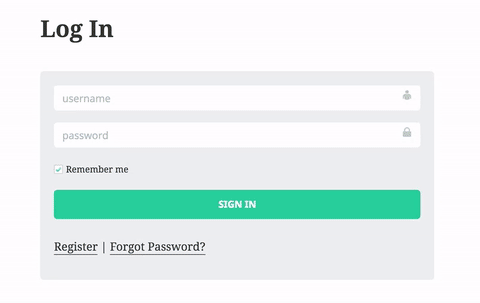
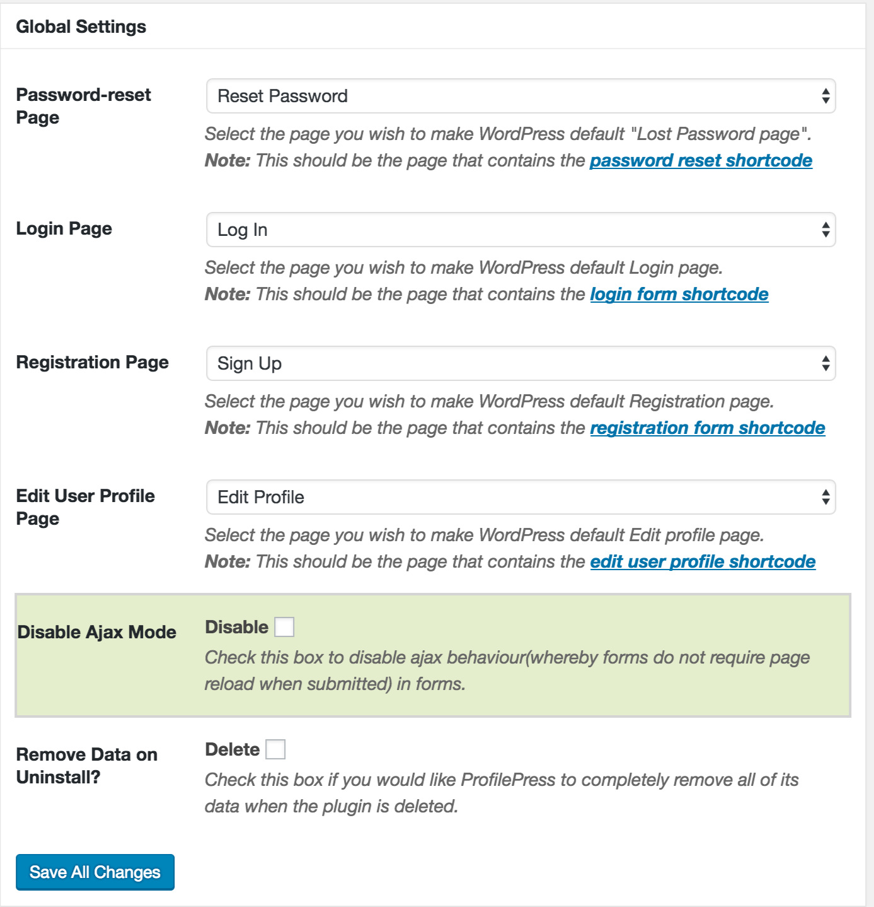

Starting from [ProfilePress](http://profilepress.net) version 2.5, Ajax mode is enabled by default whereby login, registration, password reset and edit profile forms are submitted and processed without page reload.

Below is a screenshot of how the Ajax mode works in a ProfilePress powered login form.

If for any reason you wish to disable this behaviour or feature, you can do so by clicking the **Settings** ProfilePress menu, go to the **Global Settings** section and check or tick the `Disable Ajax Mode` checkbox.

