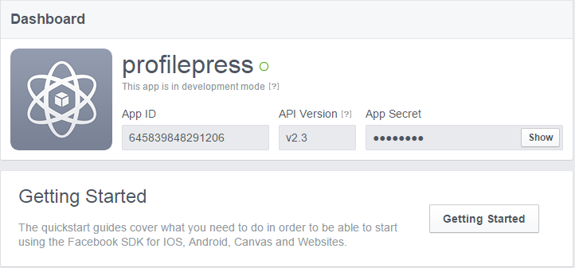
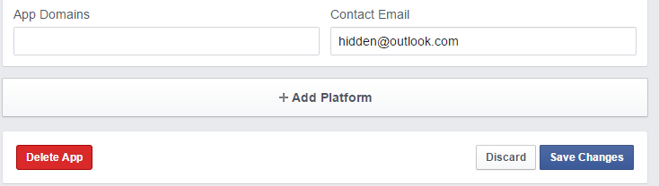
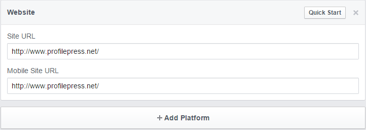
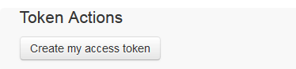
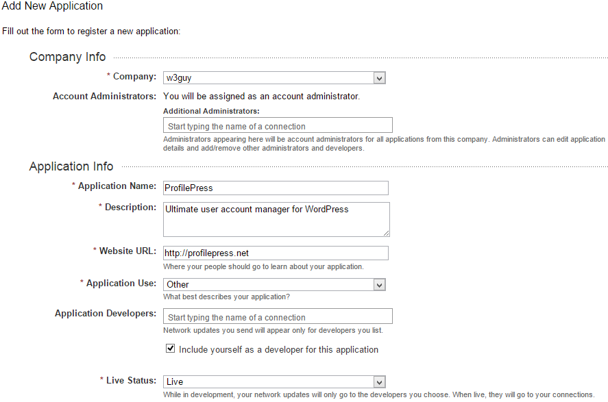
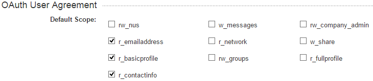
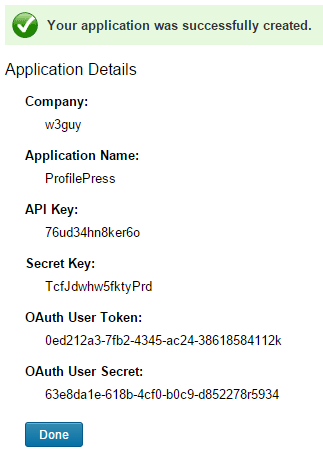
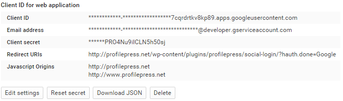

ProfilePress is bundled with a social login feature whereby users can log in to their existing account or create an account using their social media accounts.  


Currently, only Facebook, Twitter, LinkedIn, Google and GitHub is supported. More coming soon.


Let's go over the process of creating applications in the various social networks in order to get the required app. credentials.


**Note:** The generated application credentials should go into appropriate form field in `Social Login` settings page and subsequently saved.


## Creating a Facebook Application

Visit [https://developers.facebook.com](https://developers.facebook.com) and click the `Add New App` menu link.


On the pop-up page, click the `advance setup` link.


Enter a name for your new app, choose an App Category and click on `Create App ID` button.


Perform the security check and submit


Now you have successfully created a Facebook Application and you should be redirected to the Application page which should look like the one on the image below.





Currently, your application is in development or sandbox mode.

To get the App Live, click on **Status & Review** sidebar menu, slide the switch close to the app name to `Yes` and finally, click the `Confirm` button.


Go back to the application settings, click the `Add Platform` button.





Select **Website** and enter your website URL in the corresponding form and save.





Copy and save the `App ID` and `App Secrete` to ProfilePress `Social Login` plugin page.


## Creating a Twitter Application

Login to Twitter [developer center](ps://dev.twitter.com/) using your Twitter account and navigate to the [Application Management](https://apps.twitter.com/) console.


Click on the **Create New App button** to initiate the Twitter application creation.


Fill the form and click the submit button to create the application.


Below are the form fields and their description.


**Name:** Display name of your application. Also use during user authentication.


**Description:** A short description of your website.


**Website:** The full URL of your website. (prefixed with `http://` or `https://`)


**Callback URL:** `http://yoursite.com/wp-content/plugins/profilepress/social-login/?hauth.done=Twitter`.  
Replace `http://yoursite.com` with your website URL.


Read and agree to the *Developer Agreement* and finally, click the create button.


We're now done creating the application.


To get the application consumer key and secret needed by ProfilePress, navigate to the API Keys tab.


The API keys and API secret is also referred to as the consumer key and consumer secret, respectively.


Although not needed by ProfilePress, the access token and access token secrets are used for users authentication.


To get these tokens; still at the API Keys tab, scroll downward and click on the `Create my access token` button.





Refresh the page and the application tokens will be shown to you.


## Creating a LinkedIn Application

Login to [LinkedIn Developer Network](https://www.linkedin.com/secure/developer) with your LinkedIn account.


On that page click on the `Add New Application` link.


Fill the form and ensure all required fields (which has an asterisk. see the image below.





Enter your email and phone number in the **Contact Info** fields.


Tick the following checkbox in **OAuth User Agreement**: r_emailaddress, r_basicprofile, and r_contactinfo.





Enter your website url in the `OAuth 2.0` and `OAuth 1.0a Redirect URLs` fields.


Agree to the **Terms of Service** and click the `Add Application` button to create the app.


After creating the application, a success page containing the app keys and tokens will be displayed.




Copy the API Key and Secret Key to the LinkedIn field in **Social Login** plugin settings page.


## Creating a Google+ Application

Login to [Google Developers Console](https://console.developers.google.com/project) using your Google's account, click on the **Create Project** button and fill the form to create a project.


Click the newly created project to go to its dashboard.


Click the **API** sub-menu beneath **APIs & auth** and the click **Google+ API** link in **Social APIs** section.


Click the `Enable API` button to activate it.


To get the `Client ID` and `Client Secret` keys, click the `Credentials` navigation link beneath  **APIs & auth**,


Click the `Create new Client ID` button and a popup page will be displayed.  
On the popup, click the `Configure consent screen`


Fill out the consent screen form and save.


At the client ID form, enter your website URL in the **Authorized JavaScript origins** field and the code below into the **Authorized redirect URIs**

```
http://yoursite.com/wp-content/plugins/profilepress/social-login/?hauth.done=Google
```


Change `http://yoursite.com` to your website URL.


Click the `Create Client ID` submit button. You will see the application credentials displayed as shown in the image below.





Copy and paste the `Client ID` and `Client secrete` to the appriopriate field in ProfilePress social login plugin page.
