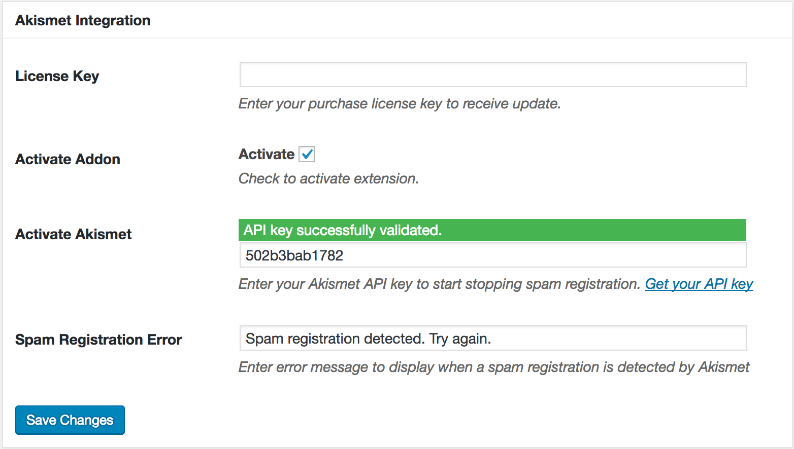

The [Akismet Integration](https://profilepress.net/downloads/woocommerce/) helps fight, stop or block spam registrations in WordPress by ensuring all sign ups or user account created through a ProfilePress powered <a href="https://profilepress.net/features/wordpress-front-end-registration-form/">registration form</a> are checked by <strong>Akismet</strong> for spam.

To get this feature working on your WordPress powered site, ensure you have the [extension](https://profilepress.net/downloads/akismet-block-spam-registration-wordpress/) installed and activated.

## Settings Overview

Click the **Extras** ProfilePress menu link.

At the **Akismet Integration** section, enter your purchase license key (to receive plugin updates when available) and check the **Activate Addon** checkbox to enable the extension or make it active.

Enter your [Akismet API key](https://akismet.com/get/) as well as the error message to display on the sign up form when spam or bot registration is detected.

Below is a screenshot of the extension settings page.

## How it Works

When users tries to register on your WordPress site, Akismet will step in and check if they are bots or spammers. If the check proves the user is not a bot, the user will be registered otherwised they will stopped with an error message to that effect displayed.

<a href="https://profilepress.net/downloads/akismet-block-spam-registration-wordpress/?ref=akismet_doc">
 

      <strong>Get Aksimet Extension</strong>
 

</a>
