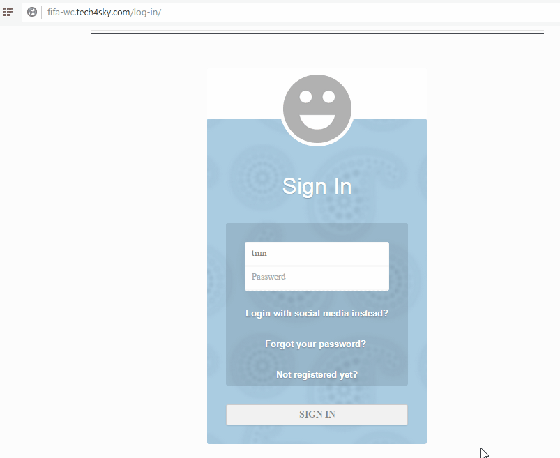
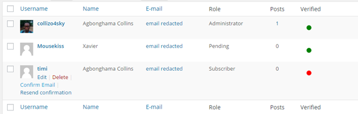

The [Email Confirmation](https://profilepress.net/downloads/email-confirmation/?ref=email_confirm_doc) for WordPress extension ensures new registered users confirm / verify their email addresses before they can log in to WordPress.


After creating or registering an account, the user will receive an email containing a link which when clicked, confirms their email address.


To get this feature working in your WordPress powered site, ensure you have the [extension](https://profilepress.net/downloads/mailchimp/) together with [ProfilePress premium](https://profilepress.net/pricing/) installed and activated.


Click the **Extras** ProfilePress menu link.


At the **User Email Confirmation** section, fill the form fields as follows:


Enter your purchase [license key](http://profilepress.net/downloads/email-confirmation/) to receive plugin updates.


Check the **Activate Extra** checkbox to enable the extension.


Fill out the following fields to configure the **email confirmation** sent to newly registered users.


By default, the email confirmation URL or link expires after 30 minutes. You can always change the expiration time at the **Link Expiration** settings field.


It is worth noting that the **Content-type** determines the format of the email confirmation message. I.e. if it will be HTML formatted or plain text.


The following settings configure the error and success notices displayed at various triggered events.


The error and success messages are pretty straight-forward save for the last two.


The **Email Confirmation Resent** notice is displayed when an unconfirmed user after trying to login, click the *resend email confirmation link*. See GIF below for clarity.




## Auto-login after Email Confirmation
This extension can also automatically log in users immediately after they confirm or verify their email addresses.


## Unconfirmed Users Deletion
One feature I love (and am pretty sure you will too) about this extension is the fact that you can delete users from WordPress database who haven't confirmed or verified their email address after a period of time.


Activate the feature by checking the **unconfirmed user deletion** checkbox and then specifies the number of days unconfirmed users will remain in WordPress before they are deleted


## Administrator Actions

Administrator of a WordPress site that has ProfilePress and this extension activated can manually confirm a user as well as resend the confirmation email to them by hovering over the user's name in WordPress users admin page and clicking the appropriate action link.



## Bypassing Email Confirmation Check During Login.
If for some odd reasons, you want users to still be able to login even when they are yet to confirm their email address; use the code snippet below.

```
add_filter('pp_bypass_check_if_user_is_activated', '__return_true');
```

If you will like to notify logged in users who haven't confirmed their email address to do so; use the shortcode `[pp-resend-email-confirmation]`. Place it wherever you want the notice displayed prefably at the sidebar of your site.

The shortcode accept two attributes: `text` and `link`. The former to customize the notice text and the latter the anchor text or link label to resend the email confirmation. Like so

```
[pp-resend-email-confirmation text="Apparently you haven't confirmed your email address" link="Do that now!"]
```

## FAQ

**Q:** Will previously registered users prior to the activation of this extension become unconfirmed or unverified?*

**A:** No. they are automatically deemed *email confirmed* / *verified*.


<a href="https://profilepress.net/downloads/email-confirmation/?ref=email_confirm_doc">
 <div class="buy-now-green">
      <strong>Get Email Confirmation Extension</strong>
 </div>
</a>
