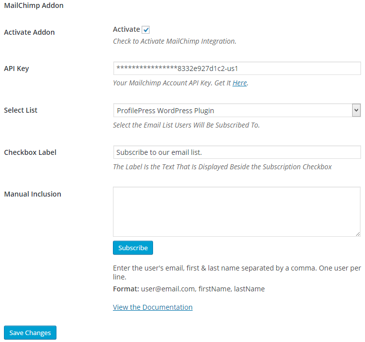

The [MailChimp](http://profilepress.net/downloads/mailchimp/) ProfilePress extension integrates your ProfilePress powered [registration page](../build/registration-form.md) with MailChimp by automatically subscribing users to a specific list immediately they complete registering an account.


To get this feature working on your WordPress powered site, ensure you have the [extension](http://profilepress.net/downloads/mailchimp/) installed and activated.


Click the **Extras** ProfilePress menu link.


At the **MailChimp Addon** section, enter your MailChimp account [API key](https://admin.mailchimp.com/account/api/) into the API field and hit the `Save Changes` button for the plugin to fetch your mailing lists.


Select the list you want users to be subscribed to and save the changes.





One feature I love (and am pretty sure you will too) about this extension is the fact you can mass subscribe a list of emails to your list from within the settings page.


Taking the user details below as an example.

```
trisha@gmail.com, Trisha, Rice
matthew@outlook.com, Matthew, Stone
geremi@yahoo.com, Geremi, Njitap
```


**Format:** emailAddress, firstName, lastName.
**Note:** only one user data per line.


If the data above is pasted into the **Manual Inclusion** textarea and the `Subscribe` button clicked, the selected email list will automatically be updated.


The process is ajaxified hence no page reload.
