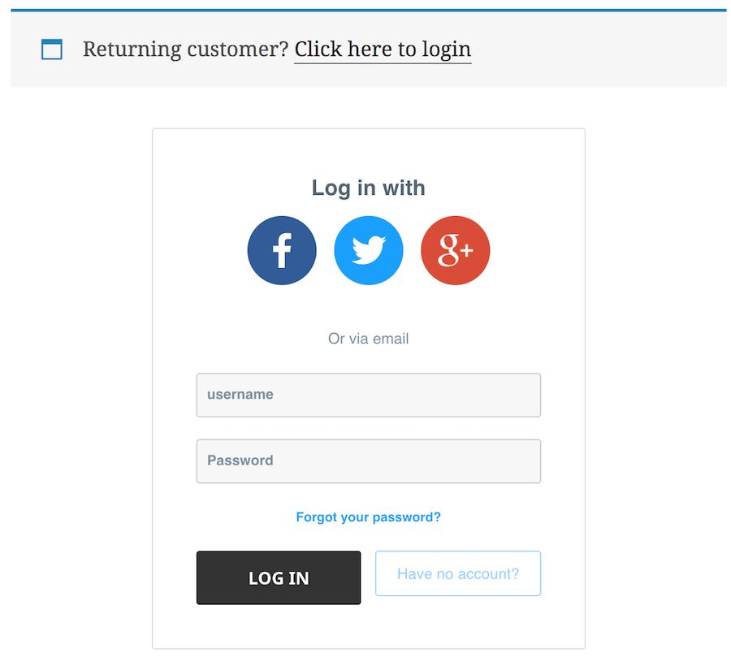
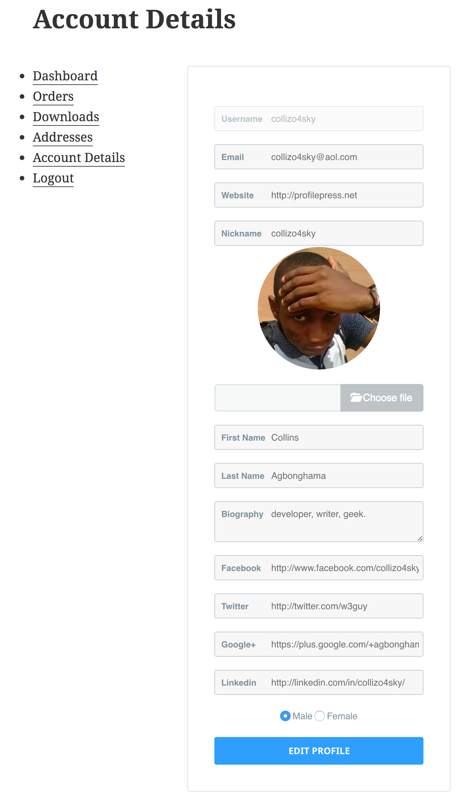
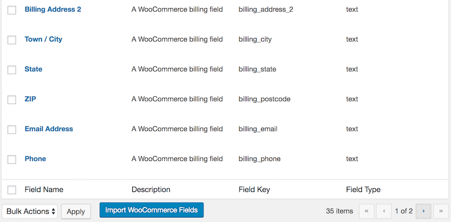

Our [WooCommerce Integration](https://profilepress.net/downloads/woocommerce/) extension allows you to manage Shipping and Billing fields with ProfilePress, replace the default WooCommerce login form and *edit account form* displayed on checkout and “My Account” pages respectively with that of ProfilePress to name a few.

To get this feature working on your WordPress powered site, ensure you have the [extension](https://profilepress.net/downloads/woocommerce/) installed and activated.

## Settings Overview

Click the **Extras** ProfilePress menu link.

At the **WooCommerce Integration** section, enter your purchase license key (to receive plugin updates when available) and check the **Activate Addon** checkbox to enable the extension or make it active.

Below is a screenshot of the extension settings page.

Let's go over the various settings and their functions.

If you consider the default login form displayed in WooCommerce checkout page not standard and/or pretty enough, you can replace it with a [ProfilePress login form](https://profilepress.net/features/wordpress-front-end-login/) of your choice by selecting your preferred option from the select dropdown in **Checkout Login Form**.

If you prefer to use a [Melange form](https://profilepress.net/downloads/tag/melange/) that has a login form as your WooCommerce checkout login, select your preferred choice from the **Checkout Login Form (Melange)** select dropdown.

When a guest or a user who isn't logged in tries to access the WooCommerce "My Account" page, a login form is usually displayed before they can get access. You can replace this form with a [ProfilePress login](https://profilepress.net/features/wordpress-front-end-login/) or [melange](https://profilepress.net/downloads/tag/melange/) form via the **"My Account" Login** and **"My Account" Login (Melange)** select dropdowns.

And finally, you can replace the form in "My Account" page for editing users/buyers Account Details with a [ProfilePress front-end edit profile form](https://profilepress.net/features/wordpress-front-end-edit-profile-form/).

## Billing / Shipping Fields Management

To manage WooCommerce core billing and shipping fields as well as custom ones added by [Checkout Field Editor extension](https://woocommerce.com/products/woocommerce-checkout-field-editor/) with ProfilePress, follow the guide below.

Firstly, you have to import them over to ProfilePress custom fields by clicking the **"Import WooCommerce Fields"** button.

To include the imported billing and shipping fields to your preferred ProfilePress registration or edit profile form, follow [this guide](../configuration/custom-fields/#registration-forms).

<a href="https://profilepress.net/downloads/woocommerce/?ref=woocommerce_doc">
 

      <strong>Buy WooCommerce Extension</strong>
 

</a>
