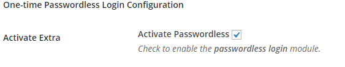

[ProfilePress](http://profilepress.net/pricing/) passwordless module allows users to log in to your WordPress powered site via a one-time URL sent to their email address which expires by default in 10mins.


## How It Works

Immediately users click the submit button of the [login form](../build/login-form.md) after entering their username in the username form field, they will receive an email containing the one-time login URL or link.


Immediately the link is clicked, they will automatically be logged in to your site.


## Set Up

Although this feature works in any existing login form in your site, be it WordPress default login or logins powered by ProfilePress; I will advice you create a new [login form](../build/login-form.md) without the password field obviously because, it won't be necessary.


To set up the passwordless one-time login feature, follow the instructions below.


Click the **Extras** ProfilePress menu


In **One-time Passwordless Login Configuration** page section, activate the feature.




If the link is expired, an error message (customizable in ProfilePress settings) will be displayed.


There are also options to customize the following:

* Disable passwordless login for administrators.
* Sender name and email address.
* Mail subject.
* Mail content.
* The expiration time in minutes the one-time URL will BE valid.
* Generated error and success messages.


*Note:* the notice displayed after the one-time login link has been sent to the user is wrapped in a div using the [CSS class for login errors](../build/login-form.md).
```
<div class="profilepress-login-status">
One-time login URL sent successfully to your email
</div>
```
