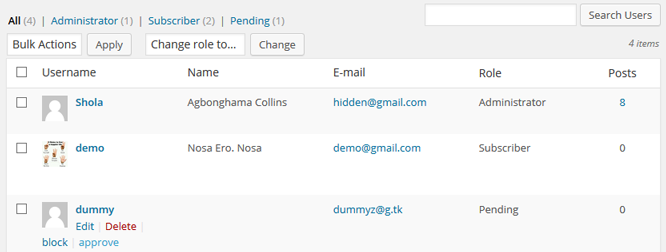
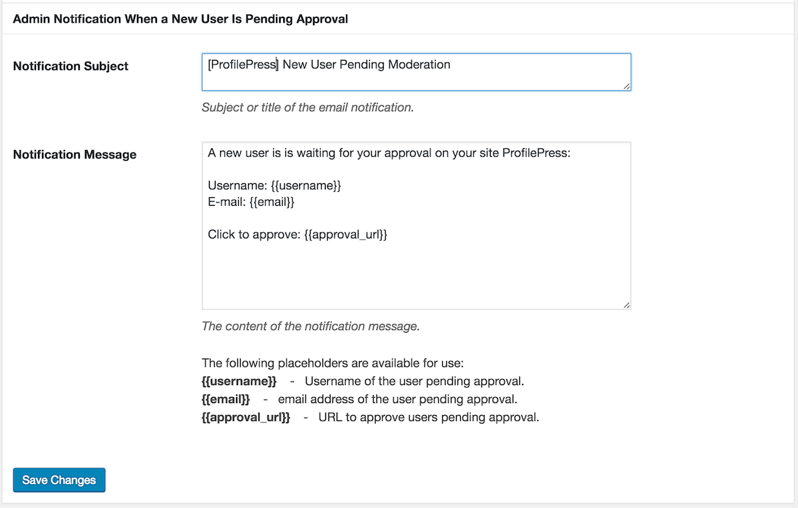

[ProfilePress](http://profilepress.net/pricing/) include a user moderation module for approving new registered users, blocking and unblocking users account in WordPress.

To activate this feature, click the **Extras** ProfilePress menu and activate it in **User Moderation** section.

After activating this feature, new users accounts will be in `pending` mode until the account is approved by an admin.

## Triggered Notifications

When a user's account is approved, blocked or unblocked; an email notification is sent to the user to that effect.

The notification message is fully customizable at ProfilePress **Settings** plugin page.

## Admin Notifications

To get notified when a user is pending approval; still on **User Moderation** section, scroll to **Admin Notification When a New User Is Pending Approval** sub-section and customize the email notification as you deem fit.

