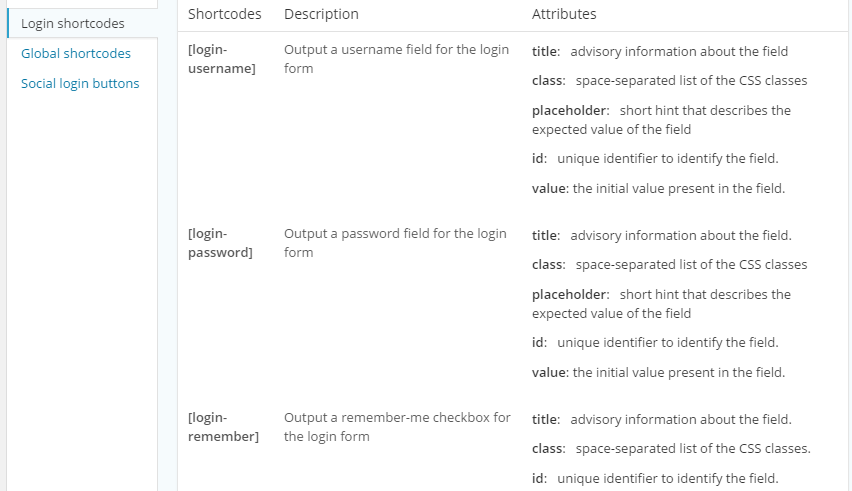
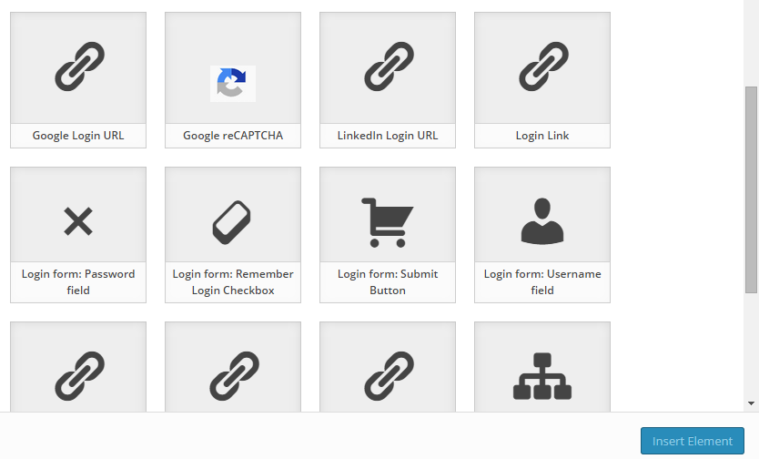

There are quite a number of shortcodes provided by ProfilePress to accomplish the task of building custom user account forms in WordPress. As a result, it will take time and effort to know them of the top of your head.

To quickly access the documentation of various ProfilePress shortcodes, click the `ProfilePress Shortcodes` button located at the top-right corner of the settings pages.

The documentation will slide in and occupy a section of the screen.

Clicking on the same button will conversely slideout / hide the documentation.

Also, clicking the `ProfilePress shortcodes` button immediately above the page design textarea reveals an interactive and intuitive form builder for creating the various ProfilePress shortcodes.

