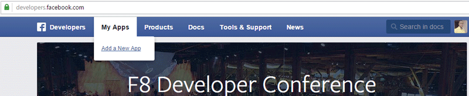

Visit [https://developers.facebook.com](https://developers.facebook.com) and click the `Add New App` menu link.

On the pop-up page, click the `advance setup` link.

Enter a name for your new app, choose an App Category and click on `Create App ID` button.

Perform the security check and submit

Now you have successfully created a Facebook Application and you should be redirected to the Application page which should look like the one on the image below.

Currently, your application is in development or sandbox mode.

To get the App Live, click on **Status & Review** sidebar menu, slide the switch close to the app name to `Yes` and finally, click the `Confirm` button.

Go back to the application settings, click the `Add Platform` button.

Select **Website** and enter your website URL in the corresponding form and save.

Copy and save the `App ID` and `App Secrete` to the appropriate fields in ProfilePress [Social Login](configuration.md) settings page.
