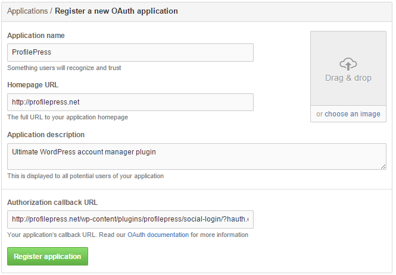
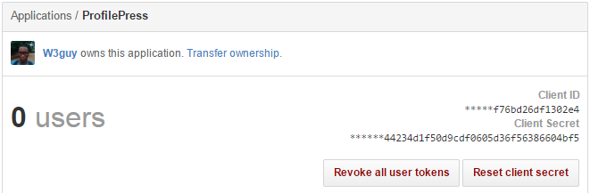

Log in to GitHub and visit [https://github.com/settings/applications](https://github.com/settings/applications).

Click the `Register new application` button.

Fill out the form as follows:

* **Application name:** Could be your website name or title.
* **Homepage URL:** Your website URL
* **Application description:** Description of your website.
* **Authorization callback URL:** `http://yoursite.com/wp-content/plugins/profilepress/social-login/?hauth.done=Github`. Replace *http://yoursite.com* with your website URL.

Hit the `Register application` button.

You will see the application's `Client ID` and `Client Secret` displayed.

Copy and paste the `Client ID` and `Client secret` to the appropriate fields in [Social Login](configuration.md) settings page.
