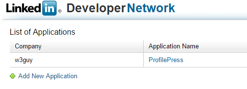
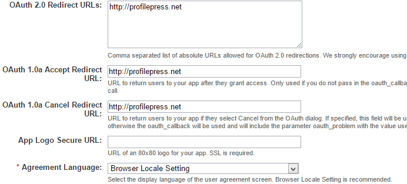

Log in to [LinkedIn Developer Network](https://www.linkedin.com/secure/developer) with your LinkedIn account.

On that page click on the `Add New Application` link.

Fill the form and ensure all required fields (which has an asterisk. see the image below.

Enter your email and phone number in the **Contact Info** fields.

Tick the following checkbox in **OAuth User Agreement**: r_emailaddress, r_basicprofile, and r_contactinfo.

**Note:** the new LinkedIn application interface has no option for `r_contactinfo`. It's nothing to worry about.

Enter your website url in the `OAuth 2.0` and `OAuth 1.0a Redirect URLs` fields.

**Note:** in the new LinkedIn application interface, use the following as your *OAuth 2.0* and *OAuth 1.0a* Redirect URLs `http://yoursite.com/wp-content/plugins/profilepress/social-login/?hauth.done=LinkedIn`

Agree to the **Terms of Service** and click the `Add Application` button to create the app.

After creating the application, a success page containing the app keys and tokens will be displayed.

Copy the `API Key` and `Secret Key` to the LinkedIn field in [Social Login](configuration.md) settings page.
